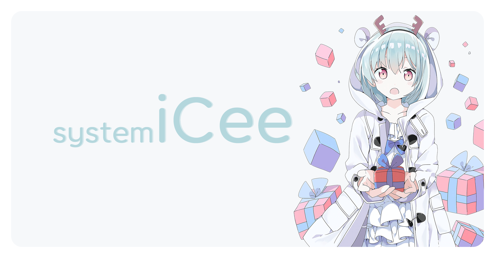

一个 Java 平台上的 Bot 框架 
~~亦或不只是 Bot 的框架~~

[~~English~~]()
| *Chinese*

[错误码表](errors.md)
| [核心程序文档](https://book.sukazyo.cc/icee/)
| [模块开发手册](https://book.sukazyo.cc/icee-module-dev/)

[~~iCommonBotsCee~~](https://github.com/suk-ws/iCommonBotsCee)
| [~~iTgDcCee~~](https://github.com/suk-ws/iTgDcCee)
| [~~iMiraiCee~~](https://github.com/suk-ws/iMiraiCee)
| [~~Coeur-iCee~~](https://github.com/suk-ws/Coeur-iCee)
| [~~iScriptCee~~](https://github.com/suk-ws/iScriptCee)
| [~~iGradleCee~~](https://github.com/suk-ws/iGradleCee)

 

---

 

### 简介

System iCee 是一个 Sukazyo Workshop 计划中的跨聊天平台(和系统平台)的 bot 程序。

现在计划上，这个项目将不会再包括任何实际 bot 功能，而只是一个 bot 平台。
当年设计上的各种功能会以插件的形式建立新库 iXxxCee 之类的。

 

### 开发计划

正在开发的内容
- [x] 配置文件
- [ ] ~~插件~~模块加载系统
- [ ] 生命周期
- [ ] 任务队列以及任务队列
- [ ] 命令接口优化

还要等一等...的内容
- [ ] CommonBot
- [ ] Telegram 支持
  - [ ] 有可能会做 osu!chat 的支持
  - [ ] 有可能会做 LINE ~~/ 开黑啦~~ 等支持
- [ ] 更加复杂~~好用~~灵活的启动逻辑

计划/考虑中的内容
- [ ] 以 [hytrans][hytrans-doc] 作为翻译规范
- [ ] 多语言的 JavaDoc 之类的（尽管很想但是相关资料很不好找）
- [ ] 自动构建一类的东西（目前看起来并不是那么的必要，而且这个东西配置起来极~麻烦，不过总之还是要有的）
- [ ] iGradleCee，用于 iCee 的~~插件~~外置模块开发环境（不确定是否需要，毕竟太远了，而且 Sukazyo 对此不了解，所以优先级很低）

[hytrans-doc]: https://book.sukazyo.cc/hytrans/

 

### 开源许可

System iCee 暂时根据 LGPL 开源。

#### 贡献指南

随便使用 pull-request / issue 即可。

不仅仅是切实的贡献，
Sukazyo 同样欢迎对还没做出来的功能或已经做出来的功能的功能建议，接口规范建议等等。

 

### iCee Background

#### 依赖的开源项目们

- [[Apa2][LCS-apa2]] [Typesafe Config](https://lightbend.github.io/config/)
HOCON 格式配置文件的 Java 工具类库
- [[Apa2][LCS-Apa2]] [log4j2](https://logging.apache.org/log4j/2.x/)
- [[Apa2][LCS-Apa2]] [Google Gson](https://github.com/google/gson)

- [[Apa2][LCS-Apa2]] [Resource Tools](https://github.com/Eyre-S/ResourceTools)

[LCS-Apa2]: https://www.apache.org/licenses/LICENSE-2.0

#### About the image

The illustration on the poster image is [Pixiv 72046240](https://www.pixiv.net/artworks/72046240)
, enm... i'm sorry that, i did not get permission but used it without permission.
If this is not appropriate, please contact sukazyo and sukazyo will remove it.

~~however, due to this is just an open source project, and i doesn't get any benefit from it, could the illustrator let go of sukazyo?~~

~~english text by Google Translate... yeah~~
